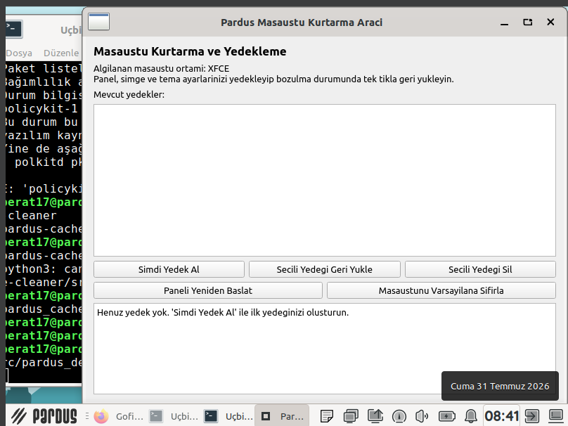
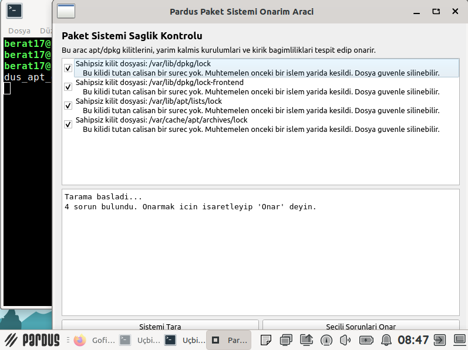
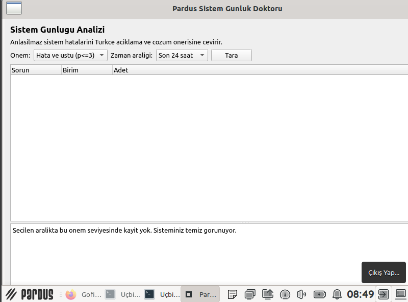
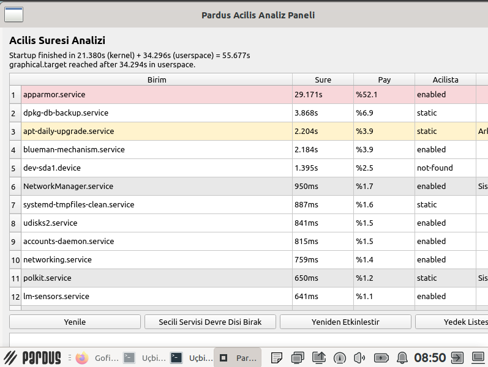
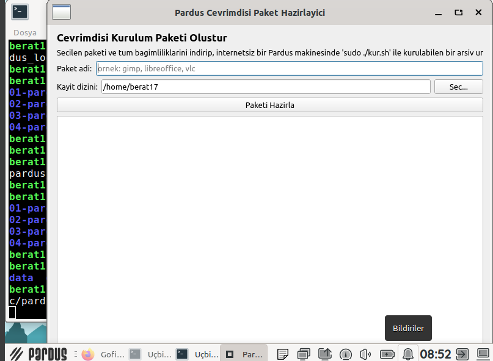

# Pardus Geliştirme ve Bakım Araçları Seti 🚀

Bu depo, **TEKNOFEST 2026 Pardus Hata Yakalama ve Öneri Yarışması (Geliştirme Kategorisi)** kapsamında son kullanıcıların Pardus işletim sistemini daha verimli, güvenli ve performanslı kullanabilmesi amacıyla sıfırdan geliştirilmiş **10 farklı aracı** içermektedir.

Tüm araçlar Pardus'un yerel yapısına uygun (GTK/Qt entegre) ve kullanıcı dostu arayüzlere (GUI) sahip olacak şekilde Python ile kodlanmıştır.

---

## 🛠️ Geliştirilen Araçlar ve Özellikleri

### 1. Pardus Disk Temizleyici (09-pardus-cache-cleaner)
Gereksiz paket önbelleklerini, eski kernel dosyalarını ve yetim paketleri silerek sistemde güvenle yer açar.

### 2. Pardus Masaüstü Kurtarıcı (08-pardus-desktop-restorer)
XFCE panel ve tema ayarlarını yedekler, bozulma anında tek tıkla geri yükler.

### 3. Pardus Paket Doktoru (03-pardus-apt-doctor)
Yarım kalan kurulumları, dpkg/apt kilitlenmelerini ve bozuk paketleri tek tıkla tespit edip onarır.

### 4. Pardus Sistem Günlük Doktoru (05-pardus-log-doctor)
Karmaşık Linux sistem hata mesajlarını (journal) analiz edip Türkçe ve anlaşılır çözüm önerileri sunar.

### 5. Pardus Açılış Analiz Paneli (06-pardus-boot-profiler)
Pardus'un açılışını (boot) yavaşlatan servisleri analiz edip listeler, optimizasyon sağlar.

### 6. Pardus Çevrimdışı Paket Hazırlayıcı (10-pardus-offline-bundler)
İnterneti olmayan Pardus makinelerine program kurabilmek için paketleri bağımlılıklarıyla beraber indirip arşivler.

### 7. Diğer Arkaplan ve İzleme Araçları
- **01-pardus-usb-syncguard (USB Senkronizasyon Koruyucu):** Büyük dosya kopyalamalarında yaşanan veri kayıplarını önler.
- **02-pardus-ram-guard (RAM Koruyucu):** Arkaplanda çalışarak bellek sızıntılarını tespit eder (Tepsi simgesi üzerinden çalışır).
- **04-pardus-port-inspector (Port İnspektörü):** Sistemdeki açık portları ve internet trafiği oluşturan uygulamaları izler.
- **07-pardus-thermal-guard (Termal Koruma):** İşlemci sıcaklığını anlık takip edip donanımı korur.

---

## 💻 Kurulum ve Çalıştırma

Her aracın kendi klasörü içerisinde bir `install.sh` kurulum betiği ve `src` klasöründe kaynak kodları bulunmaktadır. Herhangi bir aracı test etmek için klasör dizinine girip terminal üzerinden `python3 src/dosya_adi.py` şeklinde doğrudan çalıştırabilirsiniz.

**Tüm araçlar Pardus 23 XFCE üzerinde başarıyla test edilmiştir.**
